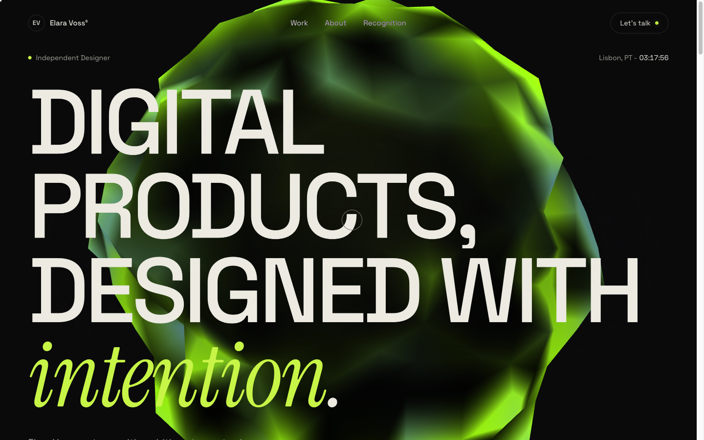

# Elara Voss - Portfolio

An awwwards-style landing page for a fictional independent product & interaction
designer. Built as a showcase of modern, motion-rich front-end craft.



## Highlights

- **Interactive WebGL hero** - a noise-displaced icosahedron sphere with a custom
  GLSL shader (3D simplex noise + recomputed normals + fresnel rim lighting).
  Reacts to the pointer and gently auto-rotates.
- **Smooth scrolling** via [Lenis](https://github.com/darkroomengineering/lenis),
  synced to GSAP's ticker and ScrollTrigger.
- **Scroll choreography** with GSAP ScrollTrigger - clip-up headings, a
  word-by-word scrubbed manifesto, staggered card reveals, and animated counters.
- **Signature work list** - hovering a project inverts the row and reveals a
  cursor-following project image with a "View" cursor.
- **Custom cursor** with hover / view / hidden states, plus magnetic buttons.
- **Branded preloader** with an animated 0-100 counter and name reveal.
- **Fully responsive** - reworked layouts down to 390px, no horizontal overflow.
- **Accessible** - honours `prefers-reduced-motion` (static sphere, no motion,
  all content visible) and `pointer: coarse` (no custom cursor on touch).

## Stack

- [Vite](https://vitejs.dev/) - dev server & bundler
- [Three.js](https://threejs.org/) - WebGL hero
- [GSAP](https://gsap.com/) + ScrollTrigger - animation
- [Lenis](https://github.com/darkroomengineering/lenis) - smooth scroll
- [SplitType](https://github.com/lukePeavey/SplitType) - text splitting
- Fonts: Space Grotesk + Instrument Serif (Google Fonts)

## Getting started

```bash
pnpm install
pnpm dev      # start the dev server (http://localhost:5173)
pnpm build    # production build to /dist
pnpm preview  # preview the production build
```

## Project structure

```
index.html          markup for every section
src/
  main.js           entry: Lenis, preloader, clock, nav, boot sequence
  style.css         design tokens + all component styles
  webgl.js          Three.js sphere (shaders, render loop, reduced-motion)
  animations.js     GSAP scroll reveals, marquee, counters, work-image reveal
  cursor.js         custom cursor + magnetic buttons
public/favicon.svg  brand mark
```

> Elara Voss is a fictional persona created for this demo. Project imagery is
> loaded from Unsplash.
